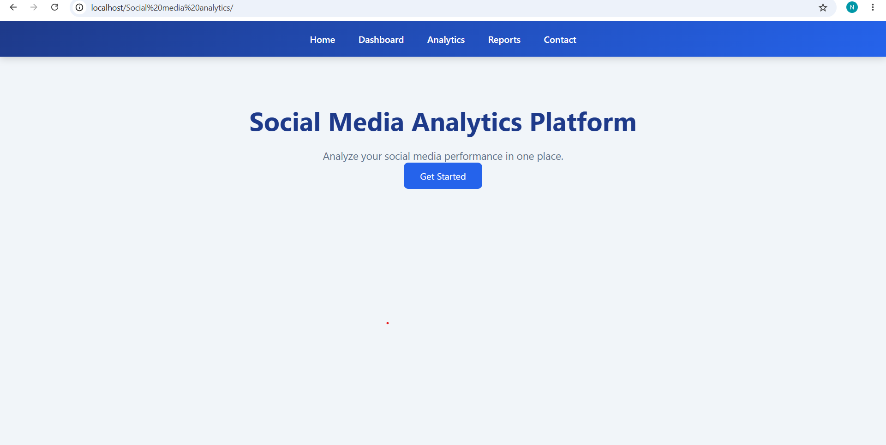
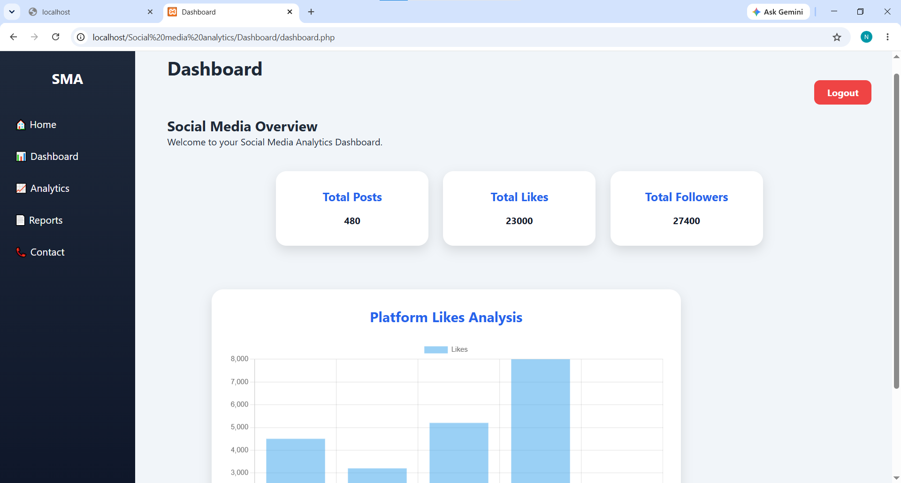
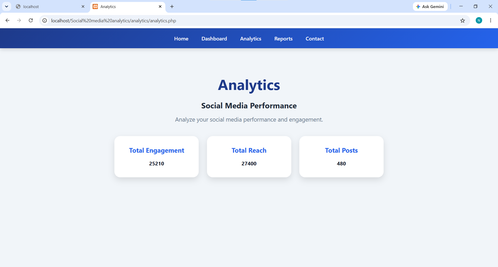
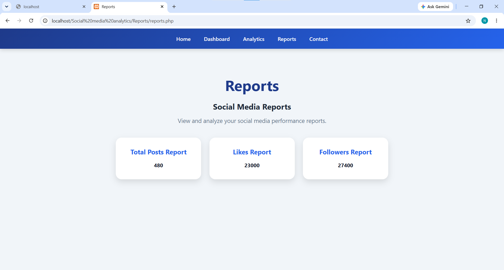

# 📊 Social Media Analytics System

## 📌 Project Overview

Social Media Analytics System is a web-based application that helps users analyze social media performance through data collection, data analysis and dashboard reporting.

The system provides insights like total posts, likes, followers, engagement rate, reach and impressions through an interactive dashboard.

---

## 🎯 Project Objective

The main objectives of this project are:

- Collect social media related data
- Analyze social media performance
- Display insights through dashboard
- Generate performance reports
- Help users understand social media growth

---

## ✨ Key Features

- Admin Login System
- Interactive Dashboard
- Social Media Analytics
- Engagement Rate Analysis
- Reach and Impression Tracking
- Reports Module
- Contact Module
- Python Data Analysis

---

## 🛠️ Technology Stack

### Frontend
- HTML
- CSS
- JavaScript

### Backend
- PHP

### Database
- MySQL

### Data Analysis
- Python

### Tools
- XAMPP
- VS Code

---

## 📂 Project Modules

### Login Module
Provides admin authentication using PHP and MySQL.

### Dashboard Module
Displays important social media metrics like posts, likes and followers.

### Analytics Module
Shows engagement rate, reach and impressions.

### Reports Module
Provides performance reports.

### Contact Module
Provides contact information.

---

# 📸 Screenshots

## Login Page

## Dashboard

## Analytics Page

## Reports Page

## 📊 Project Workflow

User Login  
↓  
Dashboard  
↓  
Dataset Processing  
↓  
Python Analysis  
↓  
Analytics Display  
↓  
Reports Generation

---

## 🚀 Future Scope

- Real-time Social Media API Integration
- AI-based Prediction
- Sentiment Analysis
- Advanced Data Visualization

---

## 👩‍💻 Author

Nisha Negi

---

## 📄 License

This project is developed for academic purposes.