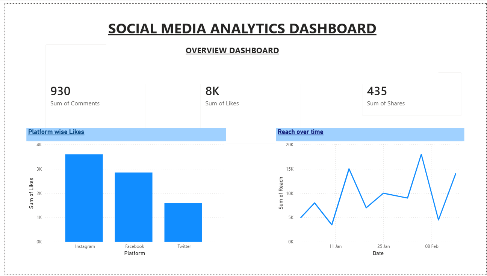
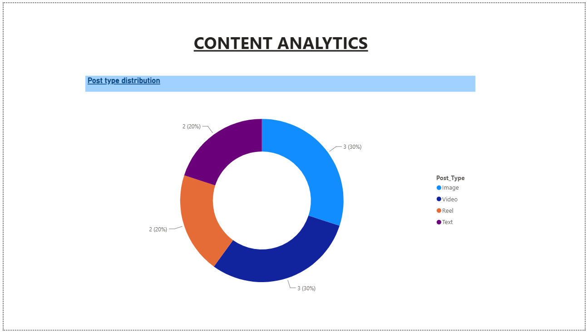
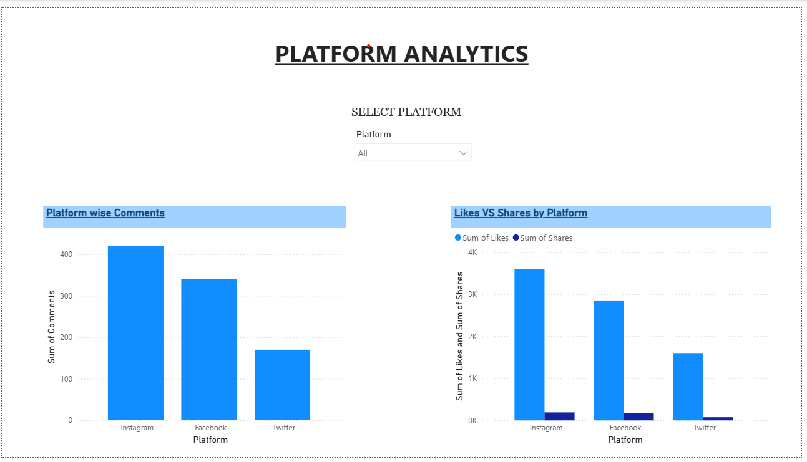

# 📊 Social Media Analytics Dashboard

## 📌 Project Overview

**Social Media Analytics** is a data analytics project developed to collect, process, analyze, and visualize social media data.

The project uses **Python, API, SQL, and Power BI** to transform raw social media data into meaningful analytical insights and interactive visualizations.

The Power BI dashboard provides an interactive view of social media performance across different platforms using key engagement metrics such as **posts, likes, comments, shares, and engagement**.

---

## 🎯 Project Objectives

The main objectives of this project are:

* To collect social media data using APIs.
* To process and prepare data using Python.
* To analyze social media data using SQL queries.
* To create an interactive Power BI dashboard.
* To compare performance across different social media platforms.
* To analyze content and engagement performance.
* To identify useful trends and patterns.
* To present analytical results through clear visualizations.

---

## 🛠️ Technology Stack

| Technology   | Purpose                                      |
| ------------ | -------------------------------------------- |
| **Python**   | Data collection, processing, and analysis    |
| **API**      | Social media data collection                 |
| **SQL**      | Data querying and analytical analysis        |
| **Power BI** | Interactive dashboard and data visualization |
| **CSV**      | Dataset storage and data exchange            |

---

## 🔄 Project Workflow

```text
       Social Media API
              ↓
     Data Collection using Python
              ↓
       Data Processing
              ↓
        SQL Analysis
              ↓
       Power BI Dashboard
              ↓
    Interactive Visualization
              ↓
       Social Media Insights
```

---

## 📂 Project Structure

```text
Social-Media-Analytics/
│
├── Dataset/
│   ├── api_data.csv
│   └── social_media_data.csv
│
├── Python/
│   ├── analytics.py
│   └── api_data_collection.py
│
├── SQL/
│   └── social_media_queries.sql
│
├── POWER BI/
│   └── Social_Media_Analytics_Dashboard.pbix
│
├── Images/
│   ├── powerbi_dashboard.png
│   ├── powerbi_content_analysis.png
│   └── powerbi_platform_analysis.png
│
├── README.md
└── .gitattributes
```

---

## 🐍 Python & API

Python is used as an important part of the data collection and processing workflow.

### Python Responsibilities

* API-based data collection
* Data processing
* Data cleaning and preparation
* Dataset generation
* Analytical calculations

### Python Files

#### `api_data_collection.py`

This script is used for collecting social media data through the API and preparing the collected data for further analysis.

#### `analytics.py`

This script is used for processing and analyzing the social media dataset.

---

## 🗄️ SQL Analysis

SQL is used to query and analyze the collected social media data.

The SQL analysis focuses on:

* Platform-wise performance
* Likes analysis
* Comments analysis
* Shares analysis
* Engagement analysis
* Content performance
* Metric comparison
* Social media performance analysis

SQL queries are available in:

```text
SQL/social_media_queries.sql
```

---

## 📊 Power BI Dashboard

The Power BI dashboard converts the processed social media data into interactive visual reports.

### Dashboard Features

* 📱 Platform-wise analysis
* 👍 Likes analysis
* 💬 Comments analysis
* 🔄 Shares analysis
* 📈 Engagement analysis
* 📝 Content performance analysis
* 🔍 Interactive slicers
* 📊 Platform comparison
* 🎯 KPI cards
* 📌 Visual data summaries

### Power BI File

The complete Power BI dashboard is available in:

```text
POWER BI/Social_Media_Analytics_Dashboard.pbix
```

---

## 📈 Key Performance Metrics

The dashboard analyzes important social media performance metrics including:

* **Total Posts**
* **Total Likes**
* **Total Comments**
* **Total Shares**
* **Engagement**
* **Platform Performance**

These KPIs help provide an overall understanding of social media activity and audience engagement.

---

## 🔍 Key Analysis

### 📱 Platform Analysis

The dashboard compares social media performance across different platforms to identify stronger-performing platforms.

### ❤️ Engagement Analysis

Likes, comments, shares, and other engagement metrics are analyzed to understand audience interaction.

### 📝 Content Analysis

Content performance is analyzed to identify content that receives stronger audience engagement.

### 📊 Performance Comparison

Different social media metrics are compared to understand variations in platform and content performance.

---

## 💡 Key Insights

The dashboard can help identify:

* Which platform performs better based on engagement.
* Which platforms receive higher likes, comments, and shares.
* Which content generates stronger audience interaction.
* How engagement varies between different platforms.
* Which metrics contribute significantly to overall performance.

> **Note:** The exact numerical insights depend on the dataset used in the Power BI dashboard.

---

## 📸 Power BI Dashboard Preview

### 📊 Main Dashboard



### 📝 Content Analysis



### 📱 Platform Analysis



---

## 📁 Dataset

The project contains datasets used for social media analysis.

### `social_media_data.csv`

Contains the primary social media dataset used for analysis and dashboard visualization.

### `api_data.csv`

Contains data collected through the API-based data collection process.

---

## 🎓 Learning Outcomes

This project helped develop practical knowledge of:

* API-based data collection
* Python programming
* Data processing and preparation
* SQL querying
* Data analysis
* Power BI dashboard development
* Data visualization
* KPI analysis
* Interactive dashboard design
* Analytical insight generation

---

## 🚀 Future Enhancements

The project can be further improved by:

* Adding more social media platforms.
* Implementing real-time API data collection.
* Automating Power BI data refresh.
* Adding advanced engagement analysis.
* Adding trend and time-series analysis.
* Implementing predictive analytics.
* Adding additional interactive dashboard features.

---

## 👩‍💻 Author

### Nisha Negi

**Project:** Social Media Analytics

**Technology Stack:** Python | API | SQL | Power BI

---

## ⭐ Project Highlights

* 🔹 API-based data collection
* 🔹 Python data processing
* 🔹 SQL analytical queries
* 🔹 Interactive Power BI dashboard
* 🔹 Platform-wise social media analysis
* 🔹 Engagement analysis
* 🔹 Content performance analysis
* 🔹 KPI-based reporting
* 🔹 Data-driven insights

---

## 📌 Project Repository

This repository contains the complete project resources, including:

**Dataset + Python Scripts + API Data Collection + SQL Queries + Power BI Dashboard + Dashboard Screenshots + Project Documentation**
